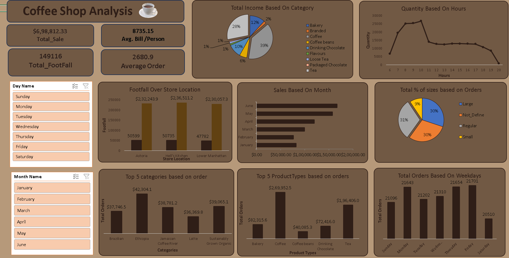

# ☕ Coffee Shop Analysis Dashboard

## 📊 Project Overview

The **Coffee Shop Analysis Dashboard** provides a comprehensive overview of sales performance, customer footfall, product category trends, and ordering behavior across time, location, and size. Built using Microsoft Power BI, this interactive dashboard empowers business stakeholders with actionable insights to enhance sales strategies, optimize inventory, and improve customer experience.

---

## 🔍 Key Insights

### 📈 High-Level KPIs
- **Total Sales**: $6,98,812.33  
- **Total Footfall**: 1,49,116 customers  
- **Average Bill/Person**: $8,735.15  
- **Average Order Value**: $2,680.90  

---

### 🗃️ Category Performance
- **Top Income Generating Category**: Coffee (39% of total revenue)
- Other significant categories: Tea (28%), Bakery (12%)

---

### 🧾 Order Trends
- **Peak Sales Hours**: Between 8 AM to 11 AM
- **Most Ordered Size**: Regular (31%) followed closely by Large (30%)

---

### 📍 Store Footfall
- **Highest Footfall**: Hell’s Kitchen with 50,735 customers
- Followed by Astoria and Lower Manhattan

---

### 📅 Time-Based Insights
- **Top Performing Month**: June
- **Top Weekdays for Orders**: Thursday and Friday (~21,700+ orders each)

---

### 🥇 Best-Selling Items (Based on Orders)
1. Coffee – $2,69,952.5  
2. Tea – $1,96,406.0  
3. Bakery – $82,315.6  

---

## 📁 Files Included

| File Name                      | Description                                |
|-------------------------------|--------------------------------------------|
| `DASHBOARD.png`               | Image of the final Power BI dashboard      |
| `Coffee_Shop_Analysis_Main.xlsx` | Raw dataset used for analysis             |
| *(Optional)* `.pbix` file     | Power BI dashboard file *(if uploading)*   |

---

## 💡 Use Cases

- Identify best-selling product categories
- Optimize staffing for peak sales hours
- Improve marketing strategies based on time and product trends
- Enhance customer satisfaction with size and pricing analytics

---

## 🛠️ Tools & Technologies

- **Microsoft Power BI** – Data modeling & visualization
- **Microsoft Excel** – Data source & cleaning

---

## 📌 Future Improvements

- Integrate customer feedback and satisfaction scores
- Forecast future sales trends using time series models
- Add geospatial heatmaps for regional performance

---

## 👨‍💻 Author

**Siraj Shaikh**  
📧 [LinkedIn](https://www.linkedin.com/in/sirajshaikh27) | 🌐 Portfolio (if available)  
_Data Analyst | Power BI Developer | Python & SQL Enthusiast_

---

